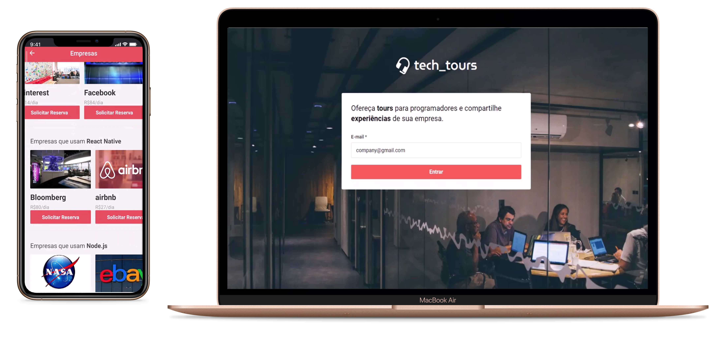

<h1 align="center">
  
</h1>

This project is divided in 3 parts, [REST API](#rest-api), [WEB](#web) and [MOBILE](#mobile). <br/><br/>
It is composed by a website where entrepreneurs can offer tours in their companies, a mobile app, where people can schedule a visit and the rest api,
to deal with all the data and logic, sending all requests and responses in real time with no need to reload any screen.

<br><br>

<br>

## REST API

### Technologies

- [Node.js](https://nodejs.org/)
- [Express](https://expressjs.com/)
- [Multer](https://github.com/expressjs/multer)
- [MongoDB](https://www.mongodb.com/)
- [Mongoose](https://mongoosejs.com/)
- [Socket.io](https://socket.io/)

## WEB

### Technologies

- [ReactJS](https://reactjs.org/)
- [React Router DOM](https://github.com/ReactTraining/react-router/tree/master/packages/react-router-dom)
- [React Icons](https://github.com/react-icons/react-icons)
- [Styled Components](https://styled-components.com/)
- [Axios](https://github.com/axios/axios)
- [Socket.io-client](https://socket.io/docs/client-api/)

## MOBILE

### Technologies

- [ReactJS](https://reactjs.org/)
- [React Native](https://reactnative.dev/)
- [React Navigation](https://reactnavigation.org/)
- [React Native Community Async Storage](https://github.com/react-native-community/async-storage)
- [React Native Vector Icons](https://github.com/oblador/react-native-vector-icons)
- [Styled Components](https://styled-components.com/)
- [Axios](https://github.com/axios/axios)
- [Socket.io-client](https://socket.io/docs/client-api/)

## GETTING STARTED

### Requirements

- [Node.js](https://nodejs.org/)
- [Yarn](https://yarnpkg.com/) or [npm](https://www.npmjs.com/)
- [git](https://git-scm.com/)
- [React Native development environment](https://reactnative.dev/docs/environment-setup)

#### Clone the project and access the folder

```shell
$ git clone https://github.com/DanielMesquitta/techtours && cd techtours
```

### Start backend

inside the techtours folder

```shell
# Go to the correct folder
$ cd backend

# Install the dependencies
$ yarn

# Start
$ yarn start
```

### Start web

In another shell with the backend running, inside the techtours folder

```shell
# Go to the correct folder
$ cd frontend

# Install the dependencies
$ yarn

# Start
$ yarn start
```

### Start mobile

**Step 1**: In another shell with the backend running, inside the techtours folder

```shell
# Go to the correct folder
$ cd mobile

# Install the dependencies
$ yarn
```

**Step 2**: Find your ip to configure your local host

```shell
# on Windows
$ ipconfig

# on Linux
$ ifconfig
```

it will probably be the first number that starts with 192.168

**Step 3**: Configure your local host
inside the mobile folder, run:

```shell
$ code src/services/api.js
```

Fell free to use your favorite editor but this step will only work with VS Code.<br/>
Change the variable `ip` according to yours machine

```js
const ip = '192.168...'
```

**Step 5**: Now, on your terminal, inside the mobile folder

```shell
# Run this if you will emulate on an android
$ yarn android

# Run this if you will emulate on an ios
$ yarn ios
```

**Step 6**: The last step is configure your emulator with your ip <br/><br/>
You need to access the developer menu on your emulator, pressing "D" inside your node.js window.<br/><br/> It will open a window on your emulator, inside there
press `settings`, then `Debug server host & port for device` and then,<br/> type your ip with `:8081` in the end.
<br/><br/>
For example, if my ip where `192.168.100.30`, I would type `192.168.100.30:8081` <br/><br/>
Now you can reload the app and you be finished
